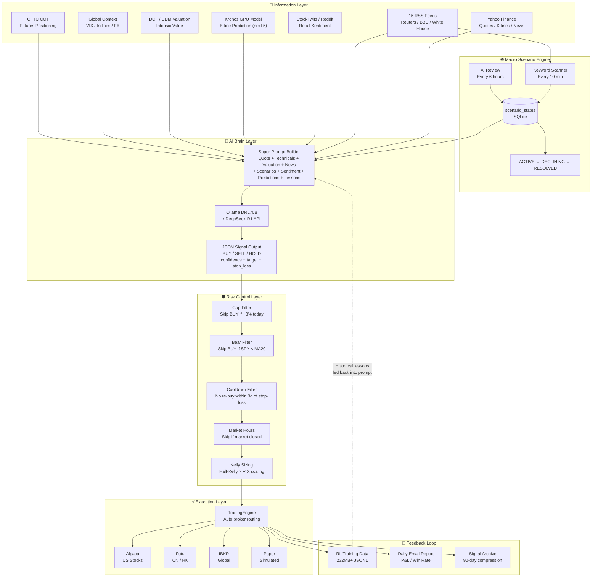
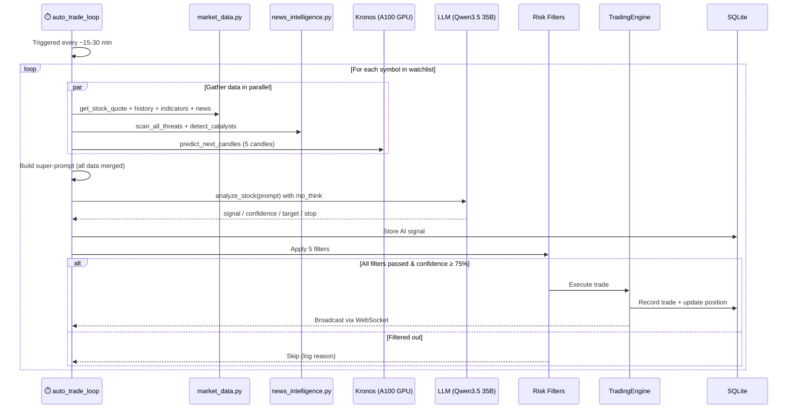
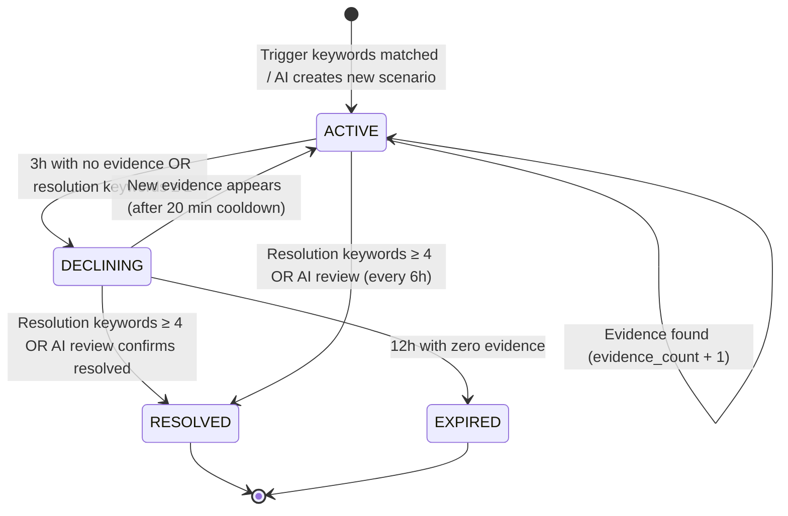
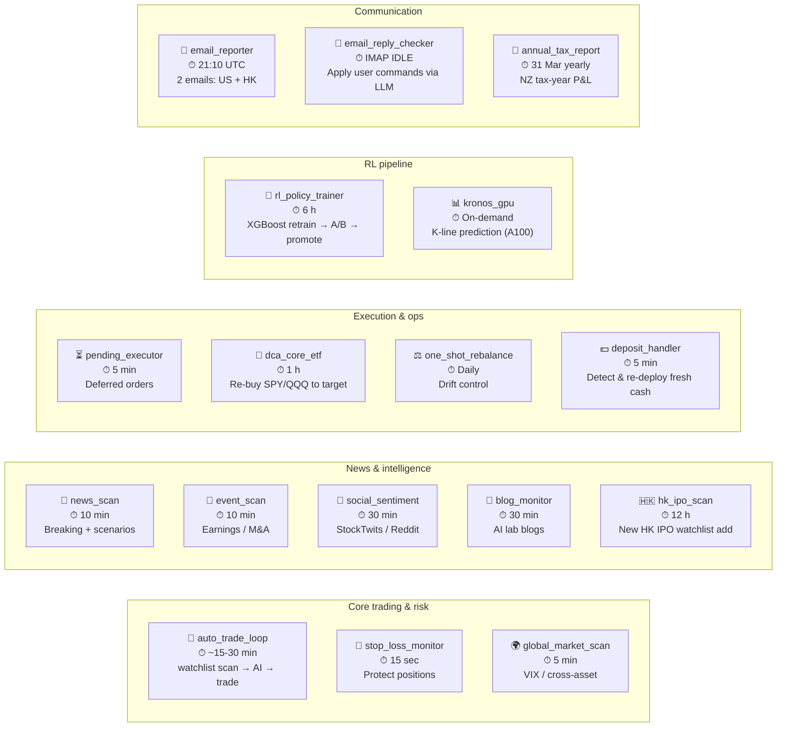
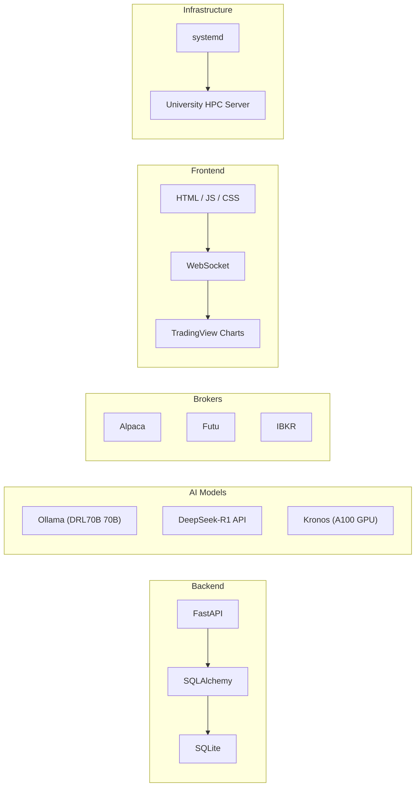

<p align="center">
  <a href="https://x.com/aleabitoreddit">
    
  </a>
</p>

<p align="center">
  <a href="https://github.com/14H034160212/serenity-skills"></a>
  <a href="https://skills.sh/14H034160212/serenity-skills"></a>
</p>

# SerenityAlphaTrader Pro

> **SerenityAlphaTrader Pro** (short name: **AlphaTrader**) — an autonomous AI trading platform whose stock-selection brain reasons through the **Serenity supply-chain chokepoint lens**.

**SerenityAlphaTrader Pro** is a fully automated AI quantitative trading system powered by a Python/FastAPI backend and a pure HTML/JS frontend. It runs a hybrid LLM stack (local Qwen3.5 35B MoE + optional DeepSeek-Cloud API) with the Kronos K-line prediction model, and executes real trades across US (Alpaca) and Hong Kong (Moomoo OpenD) markets.

### 🧭 Powered by the Serenity supply-chain lens

The trade-selection brain applies the analytical methodology of **Serenity ([@aleabitoreddit](https://x.com/aleabitoreddit))** — a public X trader and AI/semiconductor *supply-chain* analyst who traces hyperscaler capex into the overlooked upstream bottlenecks (optical/CPO, InP substrates, memory/HBM, AI power/grid). His lens is packaged as two installable agent skills under [`.claude/skills/`](.claude/skills/): `serenity-aleabitoreddit` (per-ticker theses + track record, distilled from 5,857 tweets) and `serenity-chokepoint-analysis` (the six-step chokepoint framework). Both are also published standalone at [`14H034160212/serenity-skills`](https://github.com/14H034160212/serenity-skills) — install with `npx skills add 14H034160212/serenity-skills`.

> **Attribution.** The `serenity-aleabitoreddit` skill is redistributed from the upstream research artifact [`yan-labs/serenity-aleabitoreddit`](https://github.com/yan-labs/serenity-aleabitoreddit) ([skills.sh](https://skills.sh/yan-labs/serenity-aleabitoreddit)), which independently distilled the public work of Serenity ([@aleabitoreddit](https://x.com/aleabitoreddit)). All credit for the underlying research and tweet corpus belongs to them; this project is an independent, unaffiliated redistribution. `serenity-chokepoint-analysis` is original work by [@14H034160212](https://github.com/14H034160212).

> ⚠️ **Decision-support only — not financial advice.** The Serenity lens shapes *which questions the brain asks*; it never auto-trades on copied signals. Serenity's self-reported returns are unverified and carry survivorship/selection bias; his names are volatile micro/small-caps. See the skill's risk framing.

## What's new (May 2026)

- **Hong Kong live trading** via Moomoo NZ OpenD (FUTUAU entity). HK + US in one platform; separate daily emails.
- **P0 fix — Qwen3.5 reasoning-model JSON parser**: previous extractor failed on Qwen3's free-text reasoning prefix, causing 73.9% of signals to come back as zero-conf HOLDs. Now < 1% parse-error rate via a robust extractor that handles `<think>` tags, "Thinking Process:" prefixes, multi-block JSON output, reasoning loops, and partial truncation.
- **Cross-stock catalyst engine**: macro events (e.g. Trump's 2026 China visit with CEO delegation) automatically light up every materially-exposed ticker without hand-curating keyword lists per stock. Geopolitical RSS feeds (cached) feed directly into per-symbol catalyst detection.
- **`backend/.env` secret loading**: SECRET_KEY no longer has a hardcoded fallback — must be supplied via gitignored `.env` file.
- **Scenario mute (DB column)**: user-flagged themes (e.g. Middle East/Iran in this account) are blocked from showing in reports AND from being regenerated by the AI Layer 4 scenario auto-generator.

---

## Core Features

- **Real-time Market Data**: Global market data via Yahoo Finance, auto-refreshing every 2 minutes with staggered requests to avoid rate limits.
- **K-Line Prediction**: The Kronos foundation model (trained on data from 45+ exchanges) predicts the next 5 candles based on historical data.
- **AI Decision Making**: Hybrid LLM (Qwen3.5-35B-A3B MoE for local, optional DeepSeek-Cloud API) synthesizes K-line predictions, technical indicators, news, catalysts, and social sentiment. Reasoning-model output is parsed via a robust extractor that handles `<think>` tags, free-text reasoning prefixes, and partial truncation.
- **Multi-Broker Automated Trading**:
  - **US equities** via Alpaca Live API (notional/dollar orders, fractional shares).
  - **Hong Kong equities** via Moomoo OpenD (Moomoo NZ / FUTUAU entity, REAL or SIMULATE mode; supports odd-lot HK trading).
  - **A-shares / Futu HK** also supported via the same OpenD layer.
- **Cross-Stock Catalyst Engine**: `TRUMP_CHINA_BENEFICIARIES`-style macro events automatically propagate to all materially-exposed tickers without per-symbol keyword duplication. Geopolitical RSS feeds (cached for 5 min) feed directly into per-symbol catalyst detection.
- **Linked Symbols**: BABA → 9988.HK, BIDU → 9888.HK etc — earnings news on one listing surfaces as a catalyst alert on the cross-listed sibling.
- **Geopolitical Monitoring**: Real-time tracking of 27 RSS feeds (White House, Reuters, BBC, Al Jazeera, CN financial, etc.) to auto-detect CRITICAL events.
- **Macro Scenario Lifecycle**: DB-backed scenarios with ACTIVE/DECLINING/RESOLVED/EXPIRED states. AI Layer 4 auto-generates new scenarios from news. Per-scenario `muted_by_user` flag respects user preferences across restarts.
- **Two-Path RL Feedback Loop**:
  - **Path 1 (XGBoost)** — short, fast: every 6 hours, train a candidate from `rl_training_data.jsonl`, A/B against current production by directional accuracy + RMSE, promote/shadow/reject.
  - **Path 2 (LoRA fine-tune)** — long, accurate: every ~5000 new labeled records, train Qwen3.5-35B QLoRA adapter on `training/rl_sft_dataset`, validate vs holdout, optionally hot-swap into vLLM serving.
- **Daily Email Reports**: Separate emails for US (Alpaca, kitchen-sink) and HK (Moomoo, glance-friendly). Each summarizes account, positions, today's trades, top BUY/SELL signals.
- **Reply-to-Email AI**: User can reply to the daily report; LLM parses and applies setting changes (auto-trade toggle, watchlist add/remove, confidence threshold).
- **JWT Multi-User**: Secure authentication with isolated positions, settings, and trade records per user. **SECRET_KEY MUST be supplied via `backend/.env`** — no hardcoded fallback.

---

## 📡 Data Sources and Acquisition Channels

SerenityAlphaTrader Pro utilizes multi-modal data inputs, continuously fetched in the background by automated daemon tasks:

1. **Market Data & Historical K-Lines**
   - **Channel**: Yahoo Finance (`yfinance` Python library).
   - **Content**: Real-time global stock prices, historical OHLCV data (for Kronos model input), and dozens of auto-calculated technical indicators (MACD, RSI, etc.).
   - **Mechanism**: Auto-polled every 2 minutes with staggered requests to prevent API rate limiting.
2. **Stock-Specific News & Company Updates**
   - **Channel**: Yahoo Finance News API and official AI company blog RSS feeds.
   - **Content**: Selected watchlist news summaries, major earnings releases, and industry trends.
   - **Mechanism**: Scanned automatically every 15 minutes.
3. **Retail Social Sentiment**
   - **Channel**: StockTwits and Reddit (e.g., r/wallstreetbets, r/stocks).
   - **Content**: Extraction of retail discussion volume and bullish/bearish emotion tags.
   - **Mechanism**: Polled via API or specific web scraping every 30 minutes.
4. **Geopolitical & Macroeconomic Events (Core Feature)**
   - **Channel**: 15 integrated top-tier global RSS feeds (White House, Reuters, BBC, Financial Times, etc.).
   - **Content**: Real-time capture of "CRITICAL" global macro events such as sudden wars, major sanctions, tariffs, or rate cuts.
   - **Mechanism**: High-frequency concurrent scanning every 10 minutes to trigger specific scenario playbooks and auto-execute trades on beneficiary assets.
5. **Real-World Trading Execution**
   - **Channel**: Alpaca Live API.
   - **Content**: A commission-free, API-native broker acting as the system's "execution arm".
   - **Mechanism**: Executes millisecond-level live/paper trades, strictly using Notional (dollar-amount) orders for maximum reliability.
6. **Daily Trading Experience & Feedback Loop**
   - **Channel**: Internal System Logs & Reinforcement Learning (RL) Data Collector.
   - **Content**: Extracted insights from daily profitable and losing trades, assessing why signals succeeded or failed.
   - **Mechanism**: Systematically archives execution records into `rl_training_data.jsonl` to form an ongoing feedback loop, fine-tuning future LLM trading logic.

---

## System Architecture

### Overview



### Trading Loop (Sequence)



### Macro Scenario Lifecycle



### Background Daemon Loops



### Tech Stack



---

## Environment Requirements

| Component | Version | Description |
|-----------|---------|-------------|
| Python | 3.10 (conda) | `alphatrader` conda environment |
| CUDA | 12.4+ | A100 GPU for running Kronos |
| Ollama | Any | To run the DRL70B model |
| GPU | A100 80GB × 1 | Recommend GPU-7 (most idle) |
| SQLite | Built-in | No separate installation required |

---

## One-Time Installation (Initial Deployment)

### 1. Clone the Repository

```bash
git clone https://github.com/14H034160212/AlphaTrader.git
cd /data/qbao775/AlphaTrader
```

### 2. Create Conda Environment and Install Dependencies

```bash
conda create -n alphatrader python=3.10 -y

# Install PyTorch (CUDA 12.4)
/data/qbao775/miniconda3/envs/alphatrader/bin/pip install \
    torch==2.6.0 --index-url https://download.pytorch.org/whl/cu124

# Install all project dependencies
/data/qbao775/miniconda3/envs/alphatrader/bin/pip install \
    numpy pandas \
    fastapi "uvicorn[standard]" \
    sqlalchemy \
    pydantic \
    "python-jose[cryptography]" \
    bcrypt \
    python-multipart \
    requests \
    yfinance \
    ta \
    feedparser \
    "alpaca-trade-api" \
    "alpha_vantage==2.3.1" \
    transformers \
    huggingface_hub \
    accelerate \
    sentencepiece \
    einops \
    safetensors \
    tqdm
```

### 3. Download Kronos Model Code

```bash
cd /data/qbao775/AlphaTrader/kronos_lib
git clone https://github.com/shiyu-coder/Kronos.git .
```

### 4. Download Kronos Model Weights (HuggingFace)

```bash
/data/qbao775/miniconda3/envs/alphatrader/bin/python3 -c "
from huggingface_hub import snapshot_download
snapshot_download(
    repo_id='NeoQuasar/Kronos-base',
    local_dir='/data/qbao775/AlphaTrader/kronos_lib/weights/Kronos-base',
    ignore_patterns=['*.bin']
)
snapshot_download(
    repo_id='NeoQuasar/Kronos-Tokenizer-base',
    local_dir='/data/qbao775/AlphaTrader/kronos_lib/weights/Kronos-Tokenizer-base'
)
print('Done')
"
```

### 5. Install Ollama and Pull DeepSeek-R1 70B

```bash
# Install Ollama (if not installed)
curl -fsSL https://ollama.com/install.sh | sh

# Pull DeepSeek-R1 70B (~42GB)
ollama pull DRL70B:latest

# Verify
ollama list
# Should display: DRL70B:latest   42.5GB
```

### 6. Create `backend/.env` for Secrets ⚠️ REQUIRED

The backend now refuses to start without `SECRET_KEY`. Generate a fresh 64-char hex
and store it in `backend/.env` (gitignored). `start.sh` loads it automatically.

```bash
# Generate a random key (run on your local machine, NOT in chat):
python3 -c "import secrets; print(f'SECRET_KEY={secrets.token_hex(32)}')" > backend/.env
chmod 600 backend/.env   # important — file contains a credential
```

`start.sh` sources this file via `set -a / set +a` before launching uvicorn. If
the file is missing or unreadable, the supervisor exits immediately with a fatal
log line (don't run a JWT system with no signing key).

Other secrets (Alpaca API key/secret, DeepSeek API key, Gmail app password,
Moomoo password MD5) live in the DB `settings` table, not in `.env`.

### 7. Configure systemd for Auto-Start

```bash
mkdir -p ~/.config/systemd/user

cat > ~/.config/systemd/user/alphatrader.service << 'EOF'
[Unit]
Description=SerenityAlphaTrader Backend Service
After=network.target

[Service]
Type=simple
WorkingDirectory=/data/qbao775/AlphaTrader
ExecStart=/bin/bash /data/qbao775/AlphaTrader/start.sh
Restart=on-failure
RestartSec=5
StandardOutput=append:/tmp/alphatrader.log
StandardError=append:/tmp/alphatrader.log

[Install]
WantedBy=default.target
EOF

chmod 600 ~/.config/systemd/user/alphatrader.service
systemctl --user daemon-reload
systemctl --user enable alphatrader
```

> **Note**: On shared servers where `user@.service` is in failed state (some
> NeSI-style HPC nodes), systemctl --user won't work. In that case run start.sh
> via `setsid nohup bash start.sh </dev/null >>/tmp/alphatrader.log 2>&1 &` from
> a login shell — start.sh's `while true` loop auto-restarts uvicorn on crash.

### 8. (Optional) Hong Kong Trading via Moomoo OpenD

For HK / A-share / multi-region trading, install Moomoo OpenD on the same host
as the backend (or on any host SerenityAlphaTrader can reach on port 11111).

```bash
# Download OpenD Linux tarball from Moomoo's official site
# (region-gated, must use a logged-in Moomoo account)
mkdir -p ~/moomoo-opend && cd ~/moomoo-opend
# extract the tarball: tar -xzf moomoo_OpenD_*.tar.gz --strip-components=2

# Edit OpenD.xml — fill in your Moomoo UserID + 32-char MD5 of password
#   (generate MD5 locally: printf '你的密码' | md5sum | cut -d' ' -f1)
# Enable telnet (line ~40 of OpenD.xml) for first-time 2FA setup:
#   <telnet_ip>127.0.0.1</telnet_ip>
#   <telnet_port>22222</telnet_port>
chmod 600 OpenD.xml

# First launch will trigger SMS 2FA. Pipe code in via telnet:
nohup ./OpenD > opend.console.log 2>&1 &
# Then in another shell (or via Python socket), send to 127.0.0.1:22222:
#   input_phone_verify_code -code=NNNNNN

# Wire SerenityAlphaTrader to OpenD via the DB settings table:
#   futu_enabled=true
#   futu_host=127.0.0.1
#   futu_port=11111
#   futu_security_firm=FUTUAU       # for Moomoo NZ/AU. Use FUTUSECURITIES for Futu HK
#   futu_trade_env=REAL             # or SIMULATE for paper
#   futu_hk_acc_id=<your HK acc_id>  # required when futu_trade_env=REAL
```

OpenD must complete a one-time "API Questionnaire" inside the Moomoo phone app
before it accepts any login. Without this, OpenD logs in successfully then
exits with "regulatory requirements" error.

The Hong Kong daily P&L is sent as a **separate email** from the main US report
(triggered at the same 21:10 UTC cadence).

---

## Daily Start / Stop

### Start Service

```bash
systemctl --user start alphatrader
```

### Stop Service

```bash
systemctl --user stop alphatrader
```

### Restart Service

```bash
systemctl --user restart alphatrader
```

### Check Service Status

```bash
systemctl --user status alphatrader
```

### View Real-Time Logs

```bash
tail -f /tmp/alphatrader.log
```

### Verify Service Health

```bash
curl http://localhost:8000/api/health
# Returns: {"status":"ok","timestamp":"..."}
```

---

## Initial Setup (Web UI)

Visit `http://<Server IP>:8000` and go to the settings page:

| Setting | Recommended Value | Description |
|---------|-------------------|-------------|
| AI Provider | `Local Ollama` | Use DRL70B (DeepSeek-R1 70B) |
| Alpaca API Key | Your Key | `Live` for real trades, `Paper` for testing |
| Alpaca Secret Key | Your Secret | Same as above |
| Alpaca Mode | `live` / `paper` | `paper` = simulated, `live` = real |
| Auto-Trading | `Enabled` | Auto-order when confidence ≥ 70% |
| Min Confidence | `0.70` | Minimum confidence threshold |
| Risk Per Trade | `2.0%` | Max risk exposure per trade |

---

## Quick Configuration via API (CLI)

```bash
# Get token
TOKEN=$(curl -s http://localhost:8000/api/auth/auto-login | \
    python3 -c "import sys,json; print(json.load(sys.stdin)['access_token'])")

# Configure Alpaca for Live trading
curl -s -X POST http://localhost:8000/api/settings \
    -H "Authorization: Bearer $TOKEN" \
    -H "Content-Type: application/json" \
    -d '{"key":"alpaca_api_key","value":"YOUR_KEY"}'

curl -s -X POST http://localhost:8000/api/settings \
    -H "Authorization: Bearer $TOKEN" \
    -H "Content-Type: application/json" \
    -d '{"key":"alpaca_secret_key","value":"YOUR_SECRET"}'

curl -s -X POST http://localhost:8000/api/settings \
    -H "Authorization: Bearer $TOKEN" \
    -H "Content-Type: application/json" \
    -d '{"key":"alpaca_paper_mode","value":"false"}'

# Enable auto-trading
curl -s -X POST http://localhost:8000/api/settings \
    -H "Authorization: Bearer $TOKEN" \
    -H "Content-Type: application/json" \
    -d '{"key":"auto_trade_enabled","value":"true"}'

curl -s -X POST http://localhost:8000/api/settings \
    -H "Authorization: Bearer $TOKEN" \
    -H "Content-Type: application/json" \
    -d '{"key":"ai_provider","value":"ollama"}'
```

---

## Project Structure

```text
SerenityAlphaTrader/
├── start.sh                    # Startup script (includes auto-restart daemon)
├── stop.sh                     # Stop script
├── rl_training_data.jsonl      # RL training data (appended per trade)
├── intelligence_attribution_report.json  # Signal attribution analysis report
│
├── backend/
│   ├── main.py                 # FastAPI app + background tasks
│   ├── auth.py                 # JWT authentication (bcrypt)
│   ├── database.py             # SQLAlchemy models + SQLite (incl. SignalArchive)
│   ├── trading_engine.py       # Trading engine (Alpaca Notional orders + short protection)
│   ├── market_data.py          # Market data + technical indicators
│   ├── deepseek_ai.py          # DeepSeek-R1 / Ollama AI analysis
│   ├── kronos_analysis.py      # Kronos K-line prediction (A100 GPU)
│   ├── news_intelligence.py    # News + macro scenario detection + geopolitical RSS
│   ├── social_sentiment.py     # StockTwits + Reddit sentiment scanning
│   ├── blog_monitor.py         # AI company blog RSS monitoring
│   ├── event_monitor.py        # Earnings / macro event calendar
│   ├── intelligence_feedback.py # RL signal feedback & reward calculation
│   ├── rl_data_collector.py    # RL training data collector
│   ├── quant_models.py         # Quantitative models (DCF/DDM/VPA)
│   ├── notifier.py             # Notifications
│   ├── trading_platform.db     # SQLite runtime database
│   └── requirements.txt        # Python dependencies (for reference, use conda env)
│
├── frontend/
│   ├── index.html              # SPA main page
│   ├── app.js                  # Frontend logic (market/trading/AI analysis)
│   └── styles.css              # Dark theme styles
│
└── kronos_lib/                 # Kronos model (cloned from git)
    ├── model/                  # Kronos code
    │   ├── __init__.py
    │   └── kronos.py           # KronosTokenizer, Kronos, KronosPredictor
    ├── prediction_results/     # Kronos prediction results (JSON, auto-gzipped >90 days)
    └── weights/
        ├── Kronos-base/        # Model weights (HuggingFace)
        └── Kronos-Tokenizer-base/  # Tokenizer weights
```

---

## Data Storage

| Data | Location | Description |
|------|----------|-------------|
| Users/Positions/Trades/Signals | `backend/trading_platform.db` | SQLite, auto-created |
| Weekly Signal Archives | `signal_archives` (Same DB) | >90 days signals compressed into weekly summaries |
| Price Cache | Memory | Rebuilt ~2 mins after restart |
| Kronos Predictions | `kronos_lib/prediction_results/` | JSON; compressed to gzip if >90 days old |
| RL Training Data | `rl_training_data.jsonl` | JSONL format, appended continuously |
| Signal Attribution Report | `intelligence_attribution_report.json` | Periodically updated |
| Service Logs | `/tmp/alphatrader.log` | Auto-rotated/gzipped if >200MB |

**Data Retention Policy (90 Days)**: Automated maintenance task runs daily at UTC 00:00:
- AI Signals > 90 days → Aggregated into `signal_archives` by (user, stock, week) and deleted from original table.
- Kronos JSON > 90 days → Gzipped, and JSON deleted.
- Logs > 200MB → Keep last 500 lines as summary, gzip old logs, and truncate current file.

---

## Background Tasks Overview

The following background loops run automatically once the service starts:

| Task | Frequency | Description |
|------|-----------|-------------|
| `background_price_refresh` | Every 2 mins | Refreshes price cache; staggers requests to prevent rate limiting |
| `background_auto_trade_loop` | Continuous | Scans watchlist, triggers AI analysis, and auto-trades |
| `background_news_scan` | Every 15 mins | yfinance news + macro scenario detection |
| `background_news_scan` (Geopolitical Sub-task) | Every 10 mins | 15-feed RSS geopolitical scanning; auto-triggers AI for beneficiary stocks on CRITICAL events |
| `background_event_scan` | Every 15 mins | Competitive threats + catalyst identification |
| `background_social_sentiment_scan` | Every 30 mins | StockTwits/Reddit sentiment |
| `background_blog_scan` | Every 15 mins | AI company blog RSS |
| `background_daily_summary` | Daily | Generates daily summary reports |
| `background_pending_trade_executor` | Every 1 min | Executes pending limit/stop orders |
| `_run_daily_maintenance` | Daily at UTC 00:00 | Signal archival + Kronos gzip + log rotation |

---

## Geopolitical RSS Monitoring

The system monitors these 15 sources to detect CRITICAL macro events such as wars, sanctions, or tariffs in real-time:

| Source | Description |
|--------|-------------|
| US White House | whitehouse.gov official RSS |
| US Dept of State | state.gov press releases |
| US Treasury | treasury.gov announcements |
| Reuters | Top news + World news |
| BBC | BBC World news |
| Al Jazeera | English RSS |
| The Guardian | World edition |
| NPR | International news |
| Financial Times | World news |
| Associated Press | Top headlines |
| Times of Israel | Israel news |
| Jerusalem Post | Israel news |
| OilPrice.com | Oil market news |

### Built-in Macro Scenarios

| Scenario | Severity Level | Beneficiary Assets | Assets to Avoid |
|----------|----------------|--------------------|-----------------|
| `middle_east_war_2026` | CRITICAL | GLD, IAU, SLV, XOM, LMT, RTX, NOC | TSLA, AMZN, AAPL, QQQ, TQQQ, SOXL |
| `fed_rate_cut` | HIGH | QQQ, ARKK, TSLA, NVDA, AMZN | GLD (Partially) |
| `tariff_war` | HIGH | Domestic mfg, Agriculture | Import/Export dependent stocks |
| `recession_fears` | HIGH | GLD, TLT | Cyclical stocks |

When a CRITICAL/HIGH scenario is detected, the system automatically triggers an AI analysis for the beneficiary stocks, and issues a buy order if the confidence is ≥ 70%.

---

## Alpaca Order Mechanism

The system uses **Notional (Dollar-Amount) Orders** instead of quantity (qty) orders for the following reasons:

- Alpaca limits the minimum fraction for qty orders, often causing small orders to be canceled.
- Notional orders (e.g., `notional=18.00`) specify exact dollar amounts spent, providing much higher reliability.
- Minimum order amount: $1.00

**Short Protection Mechanism**: Before selling, the system automatically verifies your position via the Alpaca API. If Alpaca shows no holding, the sell action is skipped, preventing accidental naked shorting leading to order rejections.

---

## Troubleshooting

### Service Fails to Start

```bash
# View detailed error logs
tail -50 /tmp/alphatrader.log

# Check port usage
ss -tlnp | grep 8000

# Manual startup test
cd /data/qbao775/AlphaTrader/backend
/data/qbao775/miniconda3/envs/alphatrader/bin/python3 -c "
import uvicorn
uvicorn.run('main:app', host='0.0.0.0', port=8000)
"
```

### Kronos Fails to Load (CUDA OOM)

```bash
# Check GPU memory usage
nvidia-smi --query-gpu=index,memory.used,memory.free --format=csv

# Modify start.sh to select a more idle GPU
# E.g., Change CUDA_VISIBLE_DEVICES=7 to another free GPU index
```

### Yahoo Finance Throttle (Too Many Requests)

The price refresh already operates with a 1.5s delay and 2-minute loop interval, usually avoiding throttling.
If you still hit limits, temporarily increase the refresh interval in `start.sh`.

### Alpaca Sell Rejected (not allowed to short)

The system includes short protection that auto-verifies your Alpaca holding before selling. If the error persists:

```bash
# Check if local portfolio syncs with Alpaca actual holding
curl -s http://localhost:8000/api/positions -H "Authorization: Bearer $TOKEN"

# Query actual position using Alpaca API
curl -s https://api.alpaca.markets/v2/positions \
    -H "APCA-API-KEY-ID: YOUR_KEY" \
    -H "APCA-API-SECRET-KEY: YOUR_SECRET"
```

### Alpaca Buy Order Cancelled

The system uses notional orders, so normal purchases shouldn't be cancelled. If they are:
- Ensure the account balance has enough cash (minimum $1).
- Ensure the stock supports fractional trading (some OTC stocks might not).

### Ollama Unresponsive

```bash
# Check Ollama processes
ps aux | grep ollama

# Verify model availability
curl http://localhost:11434/api/tags

# Restart Ollama
pkill ollama && ollama serve &
```

---

## Disclaimer

This project is for educational and experimental purposes only. AI trading signals do NOT constitute investment advice, and the developers hold no liability for any trading losses. Please ensure you fully understand the associated risks and validate strategies in Paper Mode before performing live trading.
