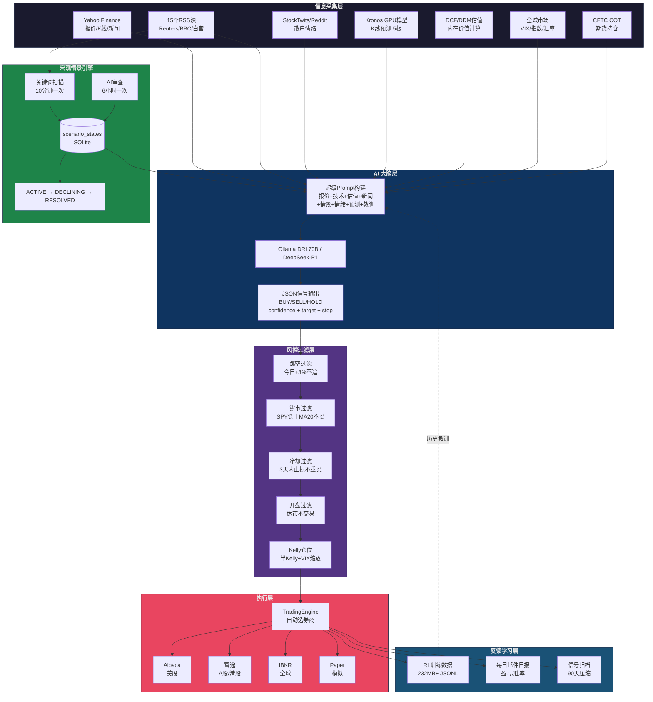
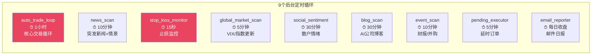
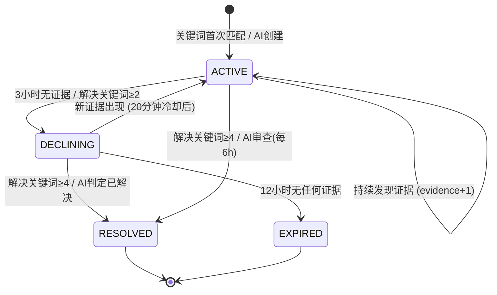
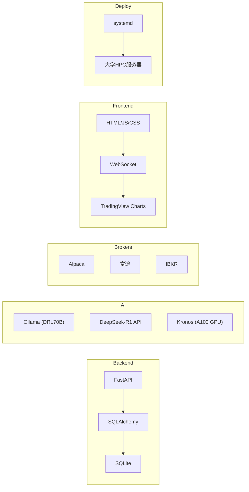

# AlphaTrader Architecture

## System Overview



## Background Loops



## Trading Loop Detail

```mermaid
sequenceDiagram
    participant Loop as auto_trade_loop
    participant MD as market_data
    participant NI as news_intelligence
    participant KR as Kronos GPU
    participant AI as LLM (70B)
    participant FLT as 5道过滤器
    participant ENG as TradingEngine
    participant DB as SQLite

    Loop->>Loop: 每1小时触发
    loop 遍历观察列表每只股票
        Loop->>MD: 获取报价+K线+技术指标+新闻
        Loop->>NI: 扫描竞争威胁+利好催化剂
        Loop->>KR: K线预测(下5根)
        Loop->>Loop: 构建超级Prompt
        Loop->>AI: 发送分析请求
        AI-->>Loop: {signal, confidence, target, stop}
        Loop->>DB: 存储AI信号
        Loop->>FLT: 过滤检查
        alt 全部通过
            FLT->>ENG: 执行交易
            ENG->>DB: 记录交易
        else 被过滤
            FLT-->>Loop: 跳过
        end
    end
```

## Scenario Lifecycle



## Tech Stack


